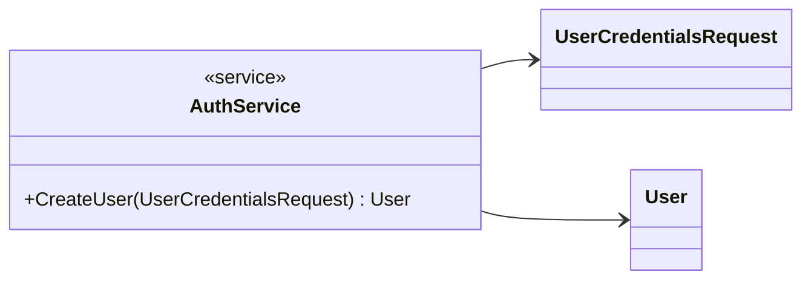
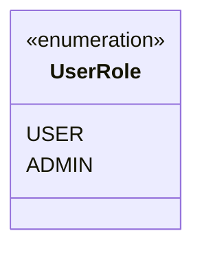
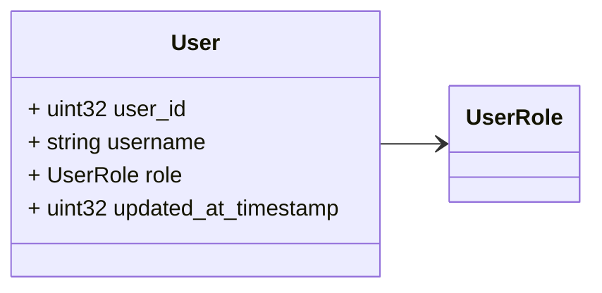
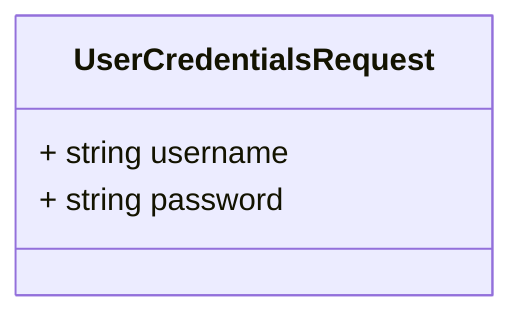
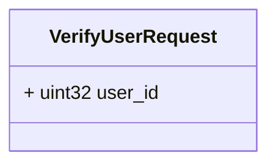
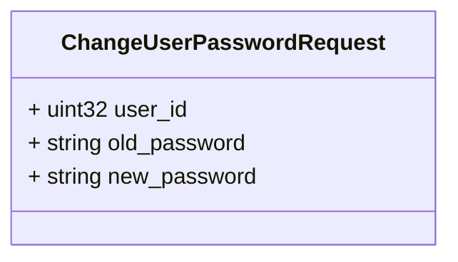

# Package: faas

 

## Imports

| Import | Description |
|--------|-------------|

## Options

| Name | Value | Description |
|------|-------|-------------|

## Service: AuthService

FQN: faas

 

### AuthService Diagram

| Method     | Parameter (In)         | Parameter (Out) | Description |
|------------|------------------------|-----------------|-------------|
| CreateUser | UserCredentialsRequest | User            |             |

## Enum: UserRole

FQN: faas.UserRole

 

| Name  | Ordinal | Description |
|-------|---------|-------------|
| USER  | 0       |             |
| ADMIN | 1       |             |

### UserRole Diagram

### User Diagram

### UserCredentialsRequest Diagram

### VerifyUserRequest Diagram

### ChangeUserPasswordRequest Diagram

## Message: User

FQN: faas.User

 

| Field                | Ordinal | Type     | Label | Description |
|----------------------|---------|----------|-------|-------------|
| user_id              | 1       | uint32   |       |             |
| username             | 2       | string   |       |             |
| role                 | 3       | UserRole |       |             |
| updated_at_timestamp | 4       | uint32   |       |             |

## Message: UserCredentialsRequest

FQN: faas.UserCredentialsRequest

 

| Field    | Ordinal | Type   | Label | Description |
|----------|---------|--------|-------|-------------|
| username | 1       | string |       |             |
| password | 2       | string |       |             |

## Message: VerifyUserRequest

FQN: faas.VerifyUserRequest

 

| Field   | Ordinal | Type   | Label | Description |
|---------|---------|--------|-------|-------------|
| user_id | 1       | uint32 |       |             |

## Message: ChangeUserPasswordRequest

FQN: faas.ChangeUserPasswordRequest

 

| Field        | Ordinal | Type   | Label | Description |
|--------------|---------|--------|-------|-------------|
| user_id      | 1       | uint32 |       |             |
| old_password | 2       | string |       |             |
| new_password | 3       | string |       |             |

<!-- Created by: Proto Diagram Tool -->
<!-- https://github.com/GoogleCloudPlatform/proto-gen-md-diagrams -->
