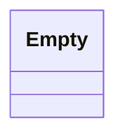

# Package: faas

 

## Imports

| Import | Description |
|--------|-------------|

## Options

| Name | Value | Description |
|------|-------|-------------|

### Empty Diagram

## Message: Empty

FQN: faas.Empty

Used to specify empty request/response rpc types 

| Field | Ordinal | Type | Label | Description |
|-------|---------|------|-------|-------------|

<!-- Created by: Proto Diagram Tool -->
<!-- https://github.com/GoogleCloudPlatform/proto-gen-md-diagrams -->
