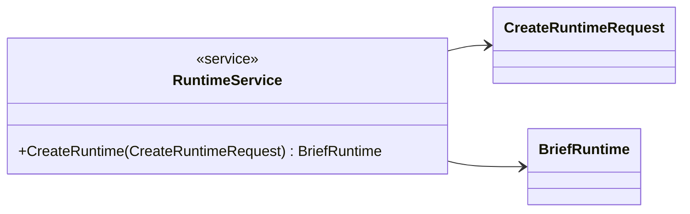
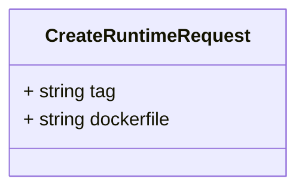
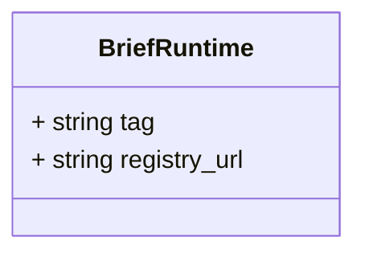
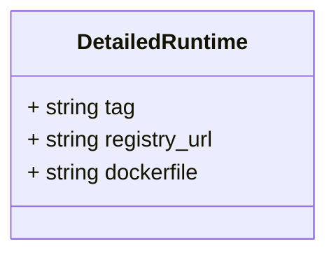

# Package: faas

 

## Imports

| Import       | Description |
|--------------|-------------|
| common.proto |             |

## Options

| Name | Value | Description |
|------|-------|-------------|

## Service: RuntimeService

FQN: faas

 

### RuntimeService Diagram

| Method        | Parameter (In)       | Parameter (Out) | Description |
|---------------|----------------------|-----------------|-------------|
| CreateRuntime | CreateRuntimeRequest | BriefRuntime    |             |

### CreateRuntimeRequest Diagram

### BriefRuntime Diagram

### DetailedRuntime Diagram

## Message: CreateRuntimeRequest

FQN: faas.CreateRuntimeRequest

 

| Field      | Ordinal | Type   | Label | Description |
|------------|---------|--------|-------|-------------|
| tag        | 1       | string |       |             |
| dockerfile | 2       | string |       |             |

## Message: BriefRuntime

FQN: faas.BriefRuntime

 

| Field        | Ordinal | Type   | Label | Description |
|--------------|---------|--------|-------|-------------|
| tag          | 1       | string |       |             |
| registry_url | 2       | string |       |             |

## Message: DetailedRuntime

FQN: faas.DetailedRuntime

 

| Field        | Ordinal | Type   | Label | Description |
|--------------|---------|--------|-------|-------------|
| tag          | 1       | string |       |             |
| registry_url | 2       | string |       |             |
| dockerfile   | 3       | string |       |             |

<!-- Created by: Proto Diagram Tool -->
<!-- https://github.com/GoogleCloudPlatform/proto-gen-md-diagrams -->
